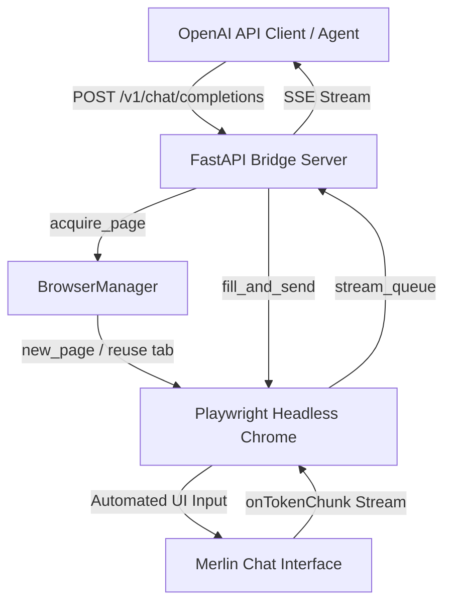

# merlin-cli-bridge — Portfolio Summary
## 1. What this is
This project is a local API bridge that exposes the web-based Merlin AI chat interface as a standard OpenAI-compatible server. It serves developers and AI agents (like Aider) who need programmatic access to advanced models on Merlin (e.g., Claude Opus) without an official API. The solution is non-trivial because it relies on Playwright to orchestrate persistent browser contexts, injects JavaScript to intercept streaming server-sent events, and manages complex state like Turnstile authentication and concurrent session multiplexing.

## 2. Honest status
- **Working**: OpenAI-compatible API endpoints for `/v1/models` and `/v1/chat/completions` with streaming chunk interception. (`server.py:434`, `server.py:704`)
- **Working**: Interactive headful login flow and stealth browser profile persistence to bypass bot detection. (`server.py:185`, `login.py:6`)
- **Working**: Multi-tab session pooling and context memory for concurrent chat requests. (`server.py:279`, `test_bridge.py:43`)
- **Partial**: Local LLM fallback proxy (for models like phi or qwen); the request handling is initiated but incomplete in the codebase. (`server.py:792`)
- **Stubbed/Dead**: MCP (Model Context Protocol) tool execution; the manager sets up the protocol but currently falls back to a hardcoded error when executing unknown tools. (`mcp_manager_temp.py:46`)

## 3. Architecture
| Name | Role | Key Files |
| --- | --- | --- |
| FastAPI Bridge Server | Intercepts standard OpenAI API calls and delegates them to browser sessions. | `server.py` |
| BrowserManager | Orchestrates Playwright Chromium instances, page acquisition, and tab pooling. | `server.py` |
| Hybrid Swarm Orchestrator | A commander script that queries the bridge for a plan and pipes it to a local executor. | `hybrid_swarm.py` |
| SkillManager | Loads and exposes virtual MCP tools from local `.gemini` and system skill paths. | `skill_manager.py` |
| CLI & Auth Utilities | Provides standalone scripts for manual login, session testing, and web interaction. | `merlin_cli.py`, `login.py`, `chat_opus.py` |

## 4. Workflow graph (the important one)


```mermaid
flowchart TD
    UserTask[User Task] --> Commander[hybrid_swarm.py]
    Commander -->|System Prompt & Task| Bridge[Merlin Bridge (Opus 4.8)]
    Bridge -->|Implementation Plan| Commander
    Commander -->|Plan + aider --model ollama/qwen2.5:3b| Executor[Local Aider Executor]
    Executor -->|Code Edits| Filesystem[Project Source Code]
```

## 5. Tech stack (proven)
- **Python / FastAPI**: Core API server framework. (`requirements.txt:1`, `server.py:1`)
- **Playwright**: Browser automation and DOM manipulation engine. (`requirements.txt:3`, `server.py:9`)
- **SQLite**: Local relational database for tracking session IDs to browser tabs. (`server.py:12`)
- **Aider**: Code execution agent invoked by the swarm orchestrator. (`start_aider.sh:24`, `hybrid_swarm.py:61`)
- **MCP (Model Context Protocol)**: Used to load tools and manage subagent capabilities. (`requirements.txt:8`, `server.py:14`)

## 6. True numbers
- 3 — Hard limit of concurrent Playwright chat pages managed by the semaphore. (`server.py:146`)
- 120 — Timeout in seconds for querying the Merlin bridge in the swarm orchestrator. (`hybrid_swarm.py:33`)
- 8 — Number of supported models configured in the default database. (`server.py:98`)
- 100 — Cost metric parameter assigned to `gemini-31-pro`. (`server.py:105`)
- 40 — Iteration wait count limit for generating the first response token. (`server.py:682`)
- 5 — Number of local directory paths checked by SkillManager to load virtual tools. (`skill_manager.py:5`)

## 7. Visual opportunities
- The Hybrid Swarm Architecture multi-stage pipeline graph from Section 4.
- The browser-based debugging screenshots generated by the server (e.g., `debug_screenshot_0.png` or `ui_screenshot.png` via `server.py:736`) showing Playwright manipulating the Merlin UI or handling a Turnstile captcha.
- The terminal output of `hybrid_swarm.py` printing "===================== THE PLAN =====================" followed by the local executor command. (Run `python hybrid_swarm.py "task"` if server is active).

## 8. Redaction warnings
- `auth.json` (contains live session cookies and authentication tokens for the user's Google/Merlin account).
- `agentic_test.py:8` (contains an API key string `merlin-local-bridge-key`).
- `start_aider.sh:20` (exports `OPENAI_API_KEY="merlin-local-bridge"`).
- `server.py:152` and `login.py:7` (expose local absolute user paths like `/home/sidd/project/...`).
- `requests_log.json` (likely contains unredacted chat history and prompt requests).

## 9. Coverage note
I did not read:
- `.aider.chat.history.md` and `.aider.input.history` because they are generated Aider logs.
- `app.html`, `chat_ui.html`, `debug.html`, `mock_merlin.html`, `merlin_dom.html`, `merlin_models_dom.html` because they are large HTML dumps for debugging or mocking, not core source logic.
- All image files (`*.png`) as they are media files.
- Folders like `venv`, `playwright_profile`, `chrome_profile`, `__pycache__`, `.git`, `obsidian_vault`, `graphify-out` because they contain external binaries, browser user data, or explicitly restricted build/data outputs.
- Database and state files like `sessions.db`, `auth.json`, `state.json`, and `requests_log.json` as they are runtime data or logs.
- Assorted small debug/helper scripts (`diag_network.py`, `dump_html.py`, `screenshot.py`, `export_auth.py`, `fix_server.py`) to prioritize reading the core entry points and main workflow modules.
